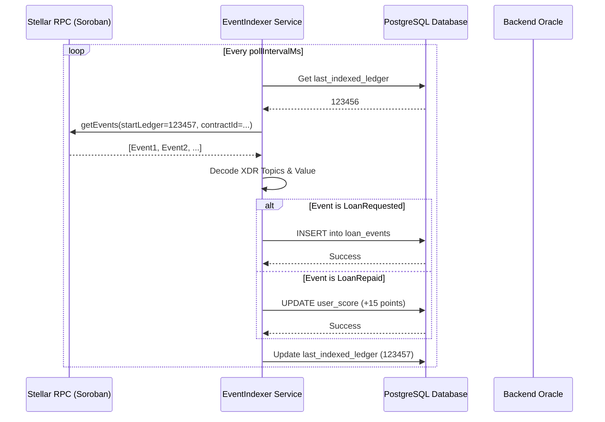

# Indexer <-> Database Sync Flow

This document explains how Remitlend synchronizes on-chain Soroban events with the off-chain PostgreSQL database for fast querying and credit score updates.

## Role of the Event Indexer

The `EventIndexer` service in the backend acts as a bridge. It polls the Stellar RPC node for contract events, decodes them, and stores the relevant data in our local database.

## Synchronization Workflow

## Implementation Details

### 1. Polling Mechanism
The indexer runs as a background process (`indexerManager.ts`) that initiates periodically based on the `INDEXER_POLL_INTERVAL_MS` environment variable (default: 30 seconds).

### 2. Event Decoding
- **Topics**: Decoded from XDR base64 using `stellar-sdk`. 
    - `topic[0]`: Event Type (e.g., `LoanRequested`)
    - `topic[1]`: Borrower Address
    - `topic[2]`: Loan ID (u32)
- **Value**: Decoded from XDR base64 based on the event type (e.g., `amount` for `LoanRequested`).

### 3. Database Schema
- **indexer_state**: Tracks the current synchronization point (`last_indexed_ledger`, `last_indexed_cursor`).
- **loan_events**: Stores every decoded event for auditing and history.
- **scores**: Maintains the current credit score for each user, updated in real-time by the indexer.

### 4. Resiliency & Reliability
- **State Persistence**: The indexer always resumes from the last successfully indexed ledger.
- **Transactions**: Event storage and score updates are wrapped in a database transaction to ensure atomicity.
- **Conflict Handling**: Uses `ON CONFLICT (event_id) DO NOTHING` to prevent duplicate processing of the same event.

## Key Files
- `backend/src/services/eventIndexer.ts`: Core logic for polling and processing.
- `backend/src/services/indexerManager.ts`: Lifecycle management for the indexer.
- `backend/src/db/connection.js`: Database connection and query execution.

## Related Documentation
- [Indexer Recovery Runbook](../runbooks/indexer-recovery.md) — Procedures for handling indexer lag, RPC outages, and quarantined events.
